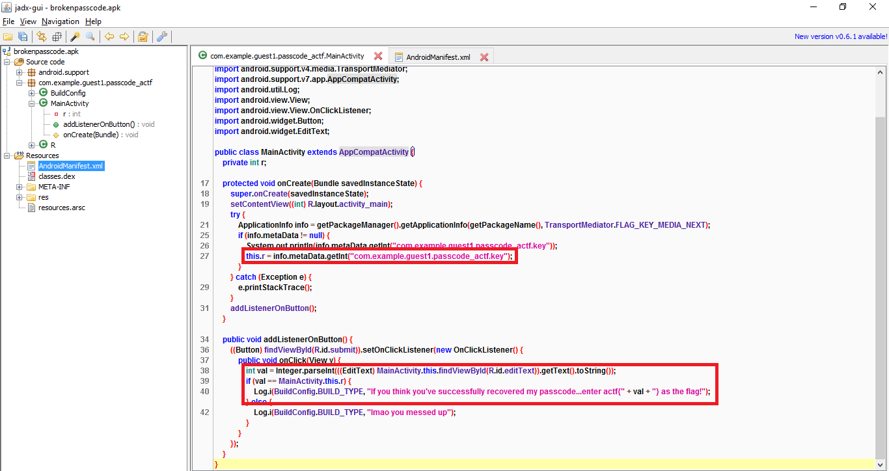
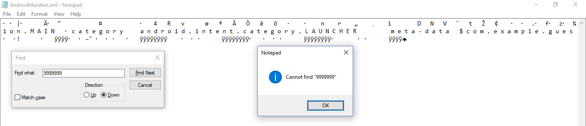

**Problem:** My friend was holding his passcode checker tool, but he was too busy looking at his screen and he tripped! Now the passcode has fallen out of the code and out of his brain. See if you can recover it.

**File:** [brokenpasscode.apk](files/brokenpasscode.apk)

**Hint:** There are no repeats in the digits of the correct passcode. If you find something that has repeats, maybe that's becuase my friend dropped it... also he suddenly had an epiphany and remembered that he hates 0s, and his passcode doesn't have any...

**Solution:**

Before I go and solve the problem, I hope you all enjoyed solving it on angstromCTF :) It was my first time writing a problem, and I hope it was challenging and fun for all of you.

Now to begin:

So the first step I usually take when looking at an apk is to run it through a decompiler (I usually use jadx-gui).

Running it through jadx-gui, I look at the MainActivity.java and see that it's a fairly simple program - it looks like it takes in a string as input, compares it to a value from the meta-data, and then says that if you think the value is correct, enter it as the flag.

The meta-data information can be found in the AndroidManifest.xml file, but we see that the answer is 9999999... that doesn't seem right! Maybe those 9s are all replacement values because the apk was 'dropped'...

Now, we just have to find out what should be there instead of those 7 9s...

If you know about Android, you know that unless you repack/resign an Android app, it preserves some information about the original apps information about how it was signed originally. Turns out that the information hasn't been changed when it was 'dropped'. I had intended that people would figure this out by wandering around and looking at what different files in the Android app did, but you could have also suspected it by installing the Android app and getting a 'parse error', which would lead you to realizing that there was something wrong with the signing. Turns out that if you look at the MANIFEST.MF file, it contains a bunch of sha-1 digests of the files, including the Manifest:

Cool! That means if we can guess/brute-force the 7 digits that should replace those 9s, we can recalculate the sha-1 and get the correct answer if it matches the sha-1 in the MANIFEST.MF file.

To get to the AndroidManfiest.xml file in a couple ways, either through a decompiler or by changing the ending of the file to .zip and unzipping (fun fact, Android apps are really just zip files). However, decompiling might cause certain issues (that will be mentioned later), so I just chose to unzip it and open up the AndroidManifest.xml file.

But if you unzip it and you look at the file in notepad, 9999999 is nowhere in sight! The same happens if you look in a hex editor - it's not right after the com.example.guest1.passcode_actf.key string...

